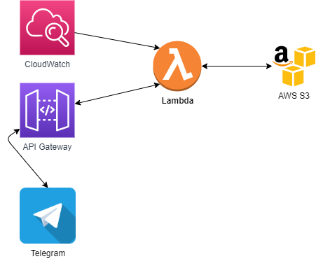

# Covid-19ITA

#### :warning: This project was developed for educational purposes without any support: do not use it as a data source or as an official channel from authority :warning:

Covid-19ITA is a(nother) Telegram bot (**[ItaCovidBot](https://telegram.me/ItaCovidBot)**) about COVID-19, which responds with some small data of Italian epidemic.

Source of numbers is the official [COVID-19](https://github.com/pcm-dpc/COVID-19), updated every day at 18:30 CET when data are usually published; all project is hosted on AWS, with a lambda function and a CloudWatch trigger for the automatic update process.

### Available commands:
- **/oggi**: the absolute and percentage difference of today's data with day before
- **/totale**: total numbers of positives, hospitalized, intensive care, died, discharged and tests done
- **/provincia *[name]***: total cases in a given province

### Diagram:

